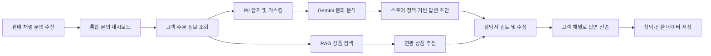
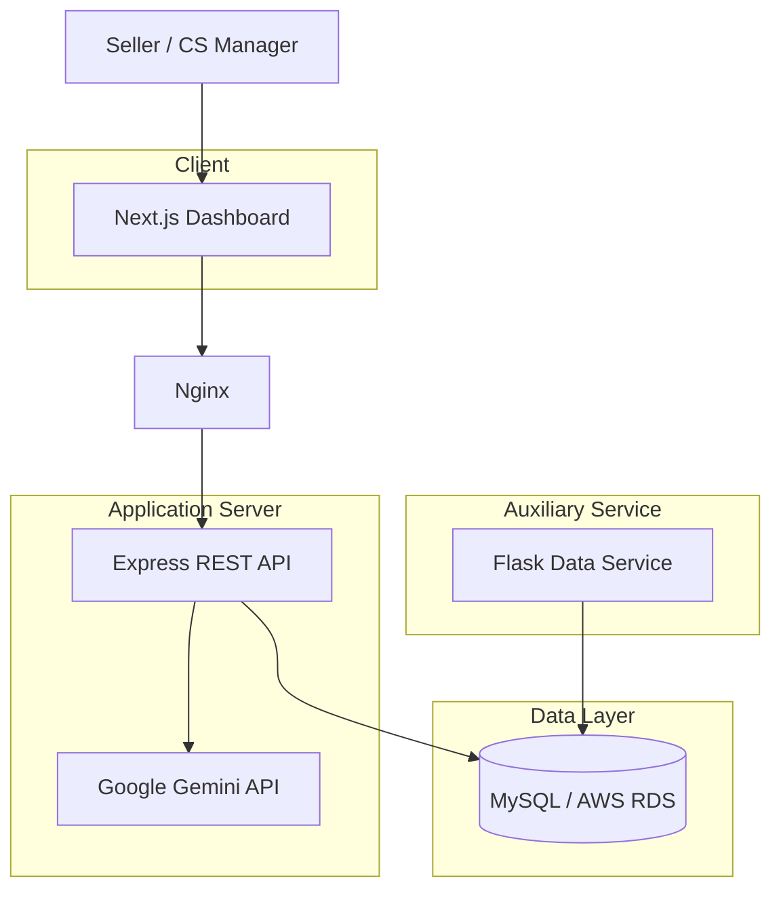

# 

> AI로 반복 문의를 줄이고, 고객 상담을 새로운 매출 기회로 전환하는 이커머스 CS 자동화 플랫폼

<div align="center">


</div>

---

## 📌 목차

1. [서비스 소개](#-서비스-소개)
2. [주요 기능](#-주요-기능)
3. [서비스 흐름](#-서비스-흐름)
4. [기술 스택](#-기술-스택)
5. [시스템 아키텍처](#-시스템-아키텍처)
6. [CS-Xit 체험하기](#-cs-xit-체험하기)
7. [사용 방법](#-사용-방법)
8. [API](#-api)
9. [프로젝트 구조](#-프로젝트-구조)
10. [팀 소개](#-팀-소개)

---

## ✨ 서비스 소개

CS-Xit은 네이버 스마트스토어, 쿠팡, 카카오톡, 이메일 등 여러 채널에서 들어오는
고객 문의를 하나의 화면에서 관리하는 AI 기반 고객 서비스 플랫폼입니다.

1인 이커머스 셀러는 배송 조회, 교환·반품, 재입고처럼 반복되는 문의 처리에
많은 시간을 사용합니다. CS-Xit은 고객 문의와 주문 정보를 분석하고,
스토어 정책과 브랜드 말투를 반영한 답변 초안을 자동으로 생성합니다.

상담 과정에서 발견한 구매 의도를 바탕으로 관련 상품까지 추천하여
고객 응대를 단순 비용이 아닌 **매출 전환 채널**로 확장합니다.

### 해결하고자 하는 문제

- 여러 판매 채널에 분산된 고객 문의
- 반복 문의 처리로 인한 셀러의 시간 낭비
- 늦은 응답으로 인한 고객 만족도 저하
- 상담 과정에서 놓치는 추가 구매 가능성
- 외부 AI 사용 시 발생할 수 있는 개인정보 노출 위험

---

## 💡 주요 기능

### 1. 옴니채널 문의 통합 관리

- 네이버, 쿠팡, 카카오톡, 이메일 문의를 하나의 대시보드에서 확인
- 신규, 진행 중, 대기 중, 완료 상태별 문의 관리
- 채널, 고객, 문의 유형, 경과 시간을 한눈에 파악
- 고객 정보와 과거 상담 이력을 티켓 화면에서 함께 제공

### 2. Gemini 기반 AI 답변 초안

- 고객 문의의 핵심 의도와 최신 메시지 분석
- 주문번호, 상품명, 문의 카테고리를 반영한 맞춤 답변 생성
- 셀러가 등록한 스토어 정책과 응대 스타일 적용
- 상담사가 초안을 검토하고 수정한 뒤 전송
- 생성된 답변과 상담 이력을 데이터베이스에 저장

### 3. 스토어별 AI 온보딩

- 스토어명과 웹사이트 정보 등록
- 운영 중인 판매 채널 선택
- 친절한, 격식 있는, 전문적인 응대 스타일 설정
- 배송, 환불, 교환 등 스토어 고유 정책 입력
- 저장된 설정을 이후 AI 답변 생성에 자동 반영

### 4. 고객 중심 티켓 워크스페이스

- 고객 등급, 연락처, 가입일, 누적 구매액 확인
- 이전 구매 내역과 상담 이력 조회
- 고객 메시지와 시스템 처리 기록을 시간순으로 표시
- AI 초안 생성, 수정, 재생성, 전송을 한 화면에서 처리

### 5. RAG 기반 상품 추천

- 문의 상품, 고객 선호도, 구매 이력을 기반으로 연관 상품 검색
- 상담 맥락에 적합한 대체 상품과 액세서리 추천
- 추천 이유와 예상 구매 가능성 제공
- 상담 답변에 상품 링크를 빠르게 삽입
- 추천 상품 클릭 및 구매 전환 성과 추적

### 6. 개인정보 보호

- 고객 문의에 포함된 이름, 전화번호, 주소, 주문번호 탐지
- 외부 AI 요청 전 개인정보 마스킹
- AI 응답 수신 후 안전한 역마스킹
- 민감 정보가 외부 모델에 원문으로 전달되지 않도록 보호

---

## 🔄 서비스 흐름



---

## 🛠 기술 스택

### Frontend

- 
- 
- 
- 
- shadcn/ui
- Radix UI
- Lucide React
- Vercel Analytics

### Backend

- 
- 
- TypeScript
- Zod
- MySQL2
- CORS
- dotenv

### AI & Data

- 
- 
- Google Gen AI SDK

### Auxiliary Data Service

- 
- 
- PyMySQL
- Gunicorn

### Infrastructure

- 
- Nginx
- AWS RDS for MySQL
- systemd (Flask service)

---

## 🏗 시스템 아키텍처



---

## 🚀 CS-Xit 체험하기

### CS-Xit을 체험해보세요

> 여러 판매 채널에 흩어진 문의를 한곳에서 관리하고,  
> AI가 스토어 정책에 맞는 답변 초안을 만드는 과정을 직접 확인해보세요.

<div align="center">

### [CS-Xit Demo 바로가기](http://15.164.227.53/)

**Demo URL:** [http://15.164.227.53/](http://15.164.227.53/)

</div>

### 혼자 운영하는 스토어일수록, 고객 응대는 더 가벼워야 합니다

배송 문의에 답하고, 교환 정책을 다시 찾아보고, 여러 판매 채널을 오가느라
상품 기획과 판매에 집중하지 못하고 계신가요?

CS-Xit은 1인 이커머스 셀러가 반복적인 고객 문의에서 벗어나
더 중요한 일에 집중할 수 있도록 돕습니다.

- 여러 채널의 고객 문의를 하나의 대시보드에서 관리하세요.
- 스토어 정책과 말투를 등록하고 일관된 고객 경험을 만들어보세요.
- Gemini가 작성한 답변 초안을 검토하고 빠르게 응답하세요.
- 고객의 관심과 문의 맥락에 맞는 상품을 추천해 추가 매출 기회를 발견하세요.
- 고객 정보와 상담 이력을 한눈에 확인하고 더 개인화된 응대를 제공하세요.

### CS는 비용이 아니라, 고객과 다시 연결되는 순간입니다

빠른 답변은 고객의 불안을 줄이고, 정확한 안내는 스토어에 대한 신뢰를 만듭니다.
CS-Xit과 함께 반복 업무에 쓰던 시간을 줄이고 고객 만족도와 구매 전환 가능성을 높여보세요.

지금 Demo에서 스토어 정보를 설정하고, 문의 대시보드와 AI 상담 워크스페이스를
직접 경험해보세요.

---

## 📖 사용 방법

### 스토어 설정

1. 스토어명과 웹사이트 URL을 입력합니다.
2. 연동할 판매 채널을 선택합니다.
3. 브랜드에 맞는 답변 스타일을 지정합니다.
4. 배송, 교환, 반품 등 운영 정책을 입력합니다.
5. 설정을 저장하고 대시보드로 이동합니다.

### 문의 처리

1. 대시보드에서 문의 상태와 대기 시간을 확인합니다.
2. 처리할 문의를 선택해 티켓 워크스페이스를 엽니다.
3. 고객 정보, 구매 이력, 과거 상담 내용을 확인합니다.
4. Gemini가 생성한 답변 초안을 검토합니다.
5. 필요한 내용을 수정하거나 초안을 다시 생성합니다.
6. 추천 상품을 답변에 추가하고 고객에게 전송합니다.

---

## 🔌 API

### Inquiries

| Method | Endpoint                      | Description           |
| ------ | ----------------------------- | --------------------- |
| `GET`  | `/api/inquiries`              | 문의 목록 조회        |
| `GET`  | `/api/inquiries/metrics`      | 상태별 문의 통계 조회 |
| `GET`  | `/api/inquiries/:id`          | 문의 상세 조회        |
| `POST` | `/api/inquiries/:id/ai-draft` | AI 답변 초안 생성     |
| `GET`  | `/api/inquiries/:id/replies`  | 저장된 답변 조회      |
| `POST` | `/api/inquiries/:id/replies`  | 상담 답변 저장        |

### Store Settings

| Method | Endpoint              | Description      |
| ------ | --------------------- | ---------------- |
| `GET`  | `/api/store-settings` | 스토어 설정 조회 |
| `POST` | `/api/store-settings` | 스토어 설정 저장 |

### Customers & Tickets

| Method  | Endpoint                  | Description    |
| ------- | ------------------------- | -------------- |
| `GET`   | `/api/customers`          | 고객 목록 조회 |
| `POST`  | `/api/customers`          | 고객 등록      |
| `GET`   | `/api/tickets`            | 티켓 목록 조회 |
| `POST`  | `/api/tickets`            | 티켓 생성      |
| `PATCH` | `/api/tickets/:id/status` | 티켓 상태 변경 |

---

## 📂 프로젝트 구조

```text
csxit/
├── app/
│   ├── page.tsx                  # 스토어 온보딩
│   ├── dashboard/page.tsx        # 문의 통합 대시보드
│   └── tickets/[id]/page.tsx     # 티켓 워크스페이스
├── components/
│   ├── onboarding/               # 스토어 및 AI 정책 설정
│   ├── dashboard/                # 문의 목록과 통계
│   ├── ticket/                   # 고객 정보, 대화, 상품 추천
│   └── ui/                       # 공통 UI 컴포넌트
├── lib/
│   ├── api.ts                    # API 설정
│   └── inquiries.ts              # 문의 타입과 초기 데이터
├── backend/
│   ├── src/
│   │   ├── routes/               # REST API 라우트
│   │   ├── services/gemini.ts    # Gemini 답변 생성
│   │   ├── db.ts                 # MySQL 연결
│   │   └── server.ts             # Express 서버
│   ├── scripts/seed.ts           # 샘플 데이터 시드
│   └── sql/                      # 데이터베이스 스키마
├── flask_service/                # 데이터 조회용 Flask 서비스
└── public/                       # 정적 리소스
```

---

## 👥 팀 소개

CS-Xit은 김가은, 서은수, 김재민, 김우진이 함께 개발한 프로젝트입니다.

---

## 📄 License

Copyright © 2026 CS-Xit Team. All rights reserved.
